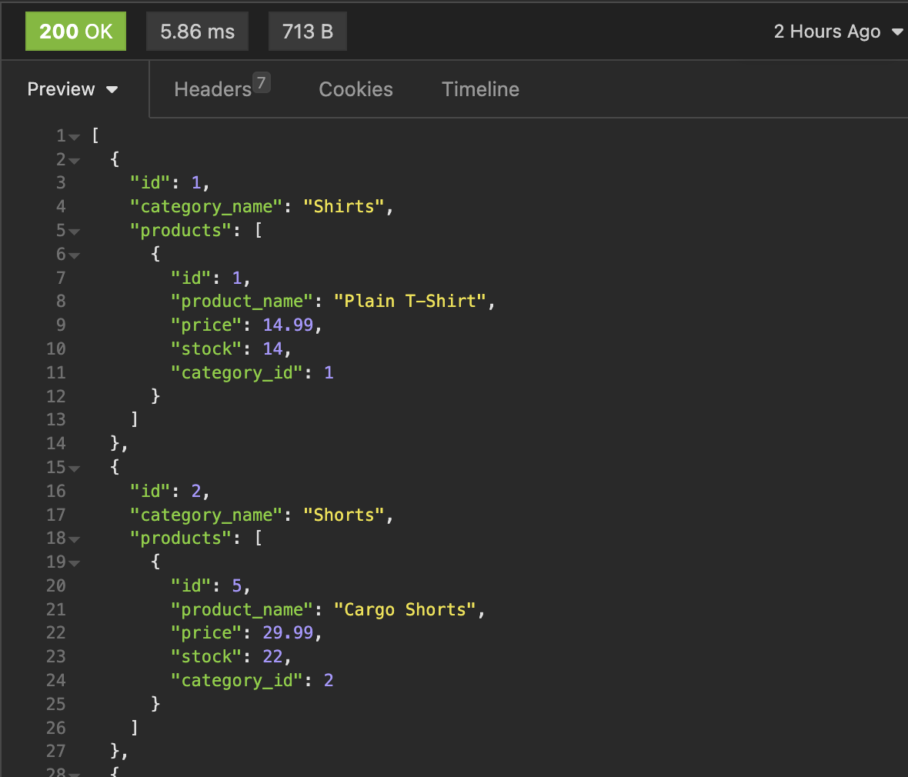

For more information on MIT visit https://opensource.org/licenses/MIT

# E-Commerce Back End
This project involves building the back end for an e-commerce site, allowing businesses and consumers to engage in online buying and selling of electronic products. This project utilizes Express.js and Sequelize to interact with a MySQL database, providing a fundamental architecture for e-commerce sites.

## Table of Contents
* [Installation](#installation)
* [Usage](#usage)
* [Contribute](#contribute)
* [License](#license)
* [Tests](#tests)
* [Features](#features)
* [Contributors](#contributors)
* [Questions](#questions)

## Installation

To begin, clone this repository and follow the steps below to set up the project:

1. Install the required dependencies using npm install.
2. Configure the .env file with your MySQL database credentials.
3. Run the schema in mysql to create the necessary database.
4. Optionally, seed the database using npm run seed to populate it with sample data.

## Usage
Follow these steps to run the application:

1. Start the server using npm start.
2. Use API testing tools like Postman or Insomnia to interact with the API endpoints.
3. Test the CRUD operations for tags, products, and categories.

## Contribute
Fork or clone the repository then make a commit.

## License

MIT License

Permission is hereby granted, free of charge, to any person obtaining a copy
of this software and associated documentation files (the "Software"), to deal
in the Software without restriction, including without limitation the rights
to use, copy, modify, merge, publish, distribute, sublicense, and/or sell
copies of the Software, and to permit persons to whom the Software is
furnished to do so, subject to the following conditions:

Copyright (c) 2023 Daniel Zarate

## Tests
n/a

# Features
* Node.js
* Express.js
* Sequelize
* MySQL Database
* (Optional: Nodemon, This makes it easier to make updates without restarting server)

Note: Because this project uses mysql it is important to have login credentials.

# Contributors

ASK BCS - Seeding data error.
Ramon Sanchez (tutor) - Sequelize error, and general express.

## Questions
Github: https://github.com/Ch40s1

Email: zaratedaniel67@gmail.com email me for any questions.

Video Walkthrough:
